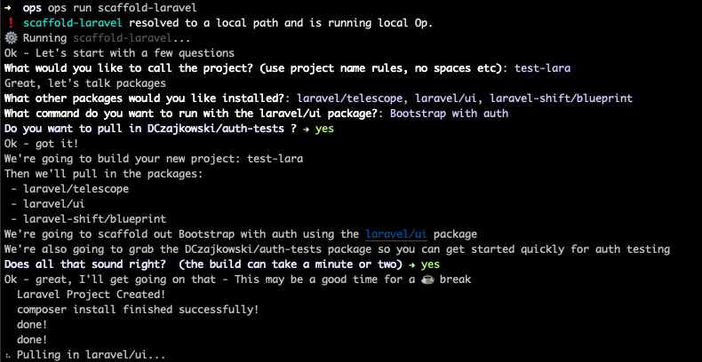

# scaffold-laravel 
*an op (check out CTO.ai) to quickly scaffold out laravel projects with common packages*



## What does this OP do?
This is a quick-install for Laravel v7 (at time of release).  The first prompt is for your project name, it then runs the `laravel new` command in a docker container, and syncs it to your current directory

After Laravel has been created, it will then pull/install any packages you indicated during the inital run

### Current Packages
* laravel-shift/blueprint (https://github.com/laravel-shift/blueprint)
    * composer requires package, creates a text file blueprint_draft.yaml in your project with a link to the docs
* laravel/telescope (https://laravel.com/docs/7.x/telescope)
    * composer requires package, then runs `php artisan telescope:install`
* laravel/ui (https://laravel.com/docs/7.x/frontend)
    * composer requires package, then will ask you if you want to run a scaffolding command
        * None - doesn't run anything
        * Bootstrap - runs `php artisan ui bootstrap`
        * Vue - runs `php artisan ui vue`
        * React - runs `php artisan ui react`
        * Bootstrap with auth - runs `php artisan ui bootstrap --auth`
        * Vue with auth - runs `php artisan ui vue --auth`
        * React with auth - runs `php artisan ui react --auth`
    * on any of the `--auth` packages, it will also prompt you if you want to require the DCzajkowski/auth-tests (https://github.com/DCzajkowski/auth-tests) package


## The Vision
Ideally this op will add more and more supported packages(composer and maybe NPM as well) so you can scaffold out your app really easily and basically start working on laravel with a nearly finished product

## Getting Started
First make sure you have the CTO.ai CLI tool - they will also require docker

Instructions on pulling the op from the registry are to come...

You should be able to run the command like this
```
op run scaffold-laravel
```
## Support/Thanks
To say thanks, you can share the project on social media or <br />

<a href="https://www.buymeacoffee.com/tDbQ4kg" target="_blank"></a>

## Issues
Please report all issues in the GitHub Issue tracker

## Speed
This package does take longer than just running the `laravel new xxxxxxxx` command locally because it actually sets it up in a docker image, and then syncs it to your current working directory.  For that reason, if you're just creating a new laravel project and don't need any of the other packages, I wouldn't use this.

## Ideas
If you have a package you always use and want to add it to this OP, just let me know, I'll do my best to add them - or fork/PR it back in.

I'd love to see this also create a database, and finish setting your .env file, but I'm not sure how that would work from inside a docker container...

## Contributing
Shoot me an email, or DM me on twitter and I am happy to allow other contributors.

## Quick Notes
This package isn't built by, maintained, or associated with Laravel at all - I just love their work.

## License 
MIT